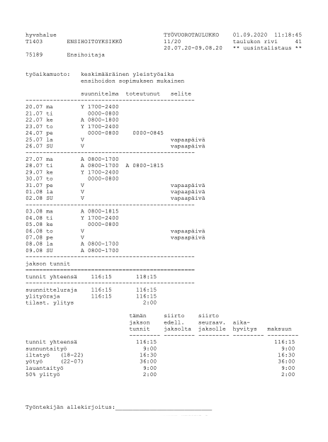

# TTC2080-3005 Full Stack -ohjelmointi, Harjoitustyö

## Laskuri työaikalisien laskemiseen 

Laskuri löytyy osoitteesta http://laskuri7000.herokuapp.com

Lataa testitiedosto oikeasta yläkulmasta

### Taustaa
Työskentelen ensihoitajana ja käyn insinööriopintoja työn ohessa. Työ on vuorotyötä ja työaikalisiä maksetaan epäsäännöllisesti. Syntyi ajatus laskurista, jolla voisi kätevästi laskea työaikalisistä kertyneen palkan. Työnantajani lähettää sähköpostiin pdf-muotoisen toteutuneen työvuorotaulukon, ns. toteuman, jossa on aina kolmen viikon toteutuneet vuorot. Itse palkkalaskelma tulee kuitenkin vasta hieman ennen palkanmaksupäivää, joten laskurilla voi laskea palkkatiedot tarkasti ennen palkkalaskelman saapumista. Alla on esimerkki toteumasta.

### Sovellus
Sovellus lukee pdf-muotoisen toteutuneen työvuorotaulukon ja palauttaa maksettavat työaikalisät sekä erittelyn käyttäjän nähtäville. Käyttäjä lataa pdf-tiedoston selaimessa sekä syöttää tuntipalkan ja veroprosentin. Tiedosto lähetetään palvelimelle, jossa pdf-tiedosto luetaan. Palvelimella ohjelma poimii tarvittavat tiedot toteumasta ja palauttaa ne takaisin asiakaspuolelle. Palveluun on mahdollista rekisteröityä, joten veroprosenttia ja tuntipalkkaa ei tarvitse syöttää joka kerta erikseen. 

### Tiedoston lataus
Tiedosto ladataan drag & dropilla tai selaamalla käyttäjän koneelta. Kun tiedosto on valittu, kysytään tuntipalkka ja veroprosentti, mikäli käyttäjä ei ole rekisteröitynyt ja tallentanut tietoja omiin asetuksiin. Tiedosto ja palkkatiedot lähetetään palvelimelle HTTP-pyyntönä (POST). Client-puolella validoidaan tiedostomuoto ja käyttäjän antamat syötteet ennen lähetystä. Ladattu tiedosto tallennetaan palvelimelle ja käynnistetään aliprosessi, jossa ajetaan pdf-tiedoston lukeva Python-skripti(tyko.py). Ohjelma palauttaa halutut oleelliset tiedot pdf-dokumentista JSON-muodossa. Skripti tarkistaa myös onko PDF-tiedosto toteuma hakemalla tiedostosta avainsanaa, joka löytyy jokaisesta toteumasta.  Tiedoston lukemiseen on käytetty Pythonia, koska en löytänyt JavaScriptille sopivaa kirjastoa tekstin poimimiseen PDF-tiedostosta.

### Laskelma
Palvelimelta palautetaan tiedot toteumasta JSON-muodossa. JSON-objekti syötetään laskurille, joka tekee laskutoimitukset palkkalaskelmaa varten. Laskuri palauttaa palkkalaskelman JSON-muodossa pääohjelmalle, joka näyttää tulokset käyttäjälle. Jos PDF-tiedosto ei ollut toteuma, siitä ilmoitetaan myös käyttäjälle.

### Rekisteröityminen
Käyttäjä voi halutessaan rekisteröityä palveluun, joten palkkatietoja ei tarvitse syöttää erikseen jokaisen laskelman yhteydessä. Rekisteröitymisessä käyttäjä valitsee käyttäjänimen ja salasanan sekä syöttää tuntipalkan ja veroprosentin. Käyttäjätiedot lähetetään palvelimelle, joka tallentaa ne MongoDB-tietokantaan. Palvelin tarkistaa tietokannasta, ettei käyttäjänimi ole jo käytössä. Salasana salataan bcryptjs-kirjaston avulla, joka muuntaa salasanan hash-muotoon. Salasanaan lisätään myös salt-merkkijono, jotta tallennettavista hash-salasanoista tulee uniikkeja, vaikka kahdella eri käyttäjällä olisi sama salasana. 

### Kirjautuminen
Käyttäjä syöttää käyttäjänimen ja salasanan, jotka lähetetään palvelimelle. Palvelin tarkistaa löytyykö tietokannasta syötettyä käyttäjänimeä. Jos käyttäjä löytyy, salasanoja verrataan bcryptjs-kirjaston avulla. Jos salasanat täsmäävät palvelin lähettää asiakaspuolelle evästeen, joka sisältää käyttäjänimen, tuntipalkan ja veroprosentin. Nämä tiedot kulkevat mukana kaikkialla asiakaspuolella. Tämä ratkaisu oli helppo, mutta ei ole kovin tietoturvallinen, koska selaimen konsolista pystyy muutamaan cookien arvoja. Joten käyttäjänimen tietämällä pääsisi ns. kirjautumaan käyttäjänä sisään ja muuttamaan käyttäjän palkkatietoja asetuksista. Käyttäjän palkkatietoja ei kuitenkaan näkisi tietokannasta, koska ne ladataan evästeeseen kirjautumisen yhteydessä ja ne tuhotaan uloskirjautumisen yhteydessä. Palvelussa ei myöskään voi vaihtaa tai nähdä salasanaa. 
Käyttäjän autentikointi ei myöskään ollut tämän kurssin oppimistavoitteissa. Jatkossa sovelluksesta voisi tehdä tietoturvallisemman esimerkiksi PassPort-kirjastoa tai session-cookieita käyttämällä.

### Asetukset
Kirjautuneena käyttäjä voi nähdä ja muuttaa palkkatietoja asetuksista. Palkkatiedot ladataan asetukset-valikkoon evästeistä.  Käyttäjän tallettaessa muutokset, ne päivitetään tietokantaan ja evästeisiin. 

### Ohjelmointi

Asiakaspuolella käytetty Vanilla JavaScriptia ja palvelinpuolella Nodea ja Expressia. PDF:n käsittelyyn on käytetty Pythonia ja PyPDF2-kirjastoa. Tietokantana toimii MongoDB:n pilvipalvelu.

Käytetyt kirjastot:

JS: mm. express, express-fileupload, child_process, bcryptjs, cookie-parser, mongoose

Python: mm. pyPDF2

### Video 

